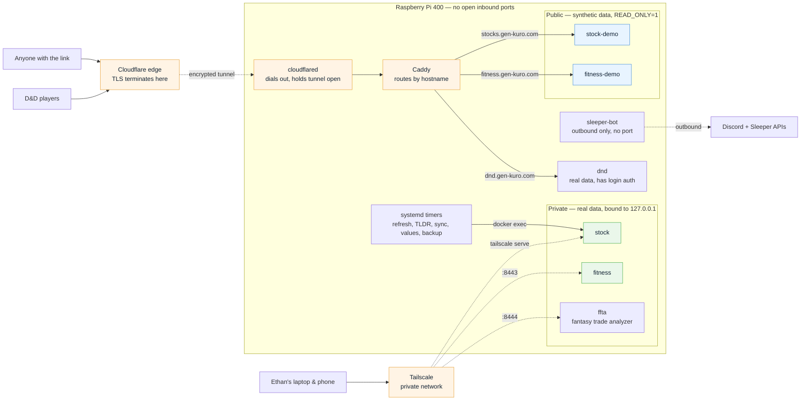

# homelab-pi

Infrastructure-as-code for a self-hosted app stack on a Raspberry Pi 400.

Takes three Flask apps that previously ran on a laptop — and only while that
laptop was awake — and hosts them permanently: public sites behind a Cloudflare
tunnel, private dashboards behind Tailscale, scheduled jobs on systemd timers,
nightly database backups. A fourth service, `sleeper-bot`, is a Discord bot
rather than a website: it makes only outbound connections and serves no traffic
at all.

## Architecture

The Pi accepts **no inbound connections**. Nothing is port-forwarded on the
router, and its public address appears in no DNS record. Every arrow below
either starts at the Pi or arrives through a connection the Pi opened.



**Reading it:** solid arrows are ordinary requests; dotted arrows are
connections the Pi itself established. The public apps (blue) and the private
apps (green) are separate containers running the *same image* against
*different databases* — so a misconfiguration exposes generated data, not real
data. `dnd` is the one app serving real data publicly, because it is the only
one with its own login.

## The problem this solves

The stock tracker's data refresh ran as a macOS `launchd` job. That has two
failure modes that never go away: it doesn't run when the laptop is asleep, and
`launchd` silently *skips* a missed run rather than catching up. So the "daily"
close-price refresh was really "the close price of whichever days I happened to
have the lid open at 4pm."

Meanwhile the dashboards only existed at `localhost:5001` and `localhost:5002`,
which meant no phone access and nothing shareable.

## Design decisions

**Public and private are separate instances, not a flag.** Two of these apps
hold personal data — real stock positions, real bodyweight and diet logs — and
neither has any authentication. Rather than making one instance serve both
audiences, the public instances run against their own databases seeded with
synthetic data (`scripts/seed_demo.py` in each app repo). A config mistake then
leaks fake numbers instead of real ones. The public instances additionally run
with `READ_ONLY=1`, which disables the mutating routes; that matters most for
the fitness dashboard, whose `/upload` endpoint accepts a file and writes it to
disk.

The D&D tracker is the exception: it goes public with real data because it is
the only one of the three with real login/session auth already built in.

**No inbound ports.** `cloudflared` dials *out* to Cloudflare and holds the
connection open, so nothing is forwarded on the router and the home IP never
appears in DNS. The private apps bind to `127.0.0.1` and are reachable only via
`tailscale serve`. The Pi is never directly addressable from the internet.

**Docker Compose, not Kubernetes.** A single 4GB Pi serving three small Flask
apps doesn't need a control plane; k8s here would be cost with no benefit.
(Kubernetes versions of other projects live in `url-shortener-k8s`.)

**The Discord bot joins no network and publishes no port.** `sleeper-bot`
(source in `../sleeper-discord-bot`) polls the Sleeper API and holds a
websocket out to Discord — every connection it makes is outbound, so it needs
neither the `edge` network nor a port binding. It is the one service where the
Pi being behind NAT is an advantage rather than something to work around. Its
volume holds the record of which league transactions have been announced, so
losing it means the next start replays the week into a real group chat.

**systemd timers, not cron.** `Persistent=true` re-runs a job that was missed
while the machine was off — the exact gap that made the `launchd` setup
unreliable. Timers also log to `journald` instead of an ever-growing logfile.

## Layout

```
docker-compose.yml     services, volumes, which instance is public vs private
caddy/Caddyfile        routes public hostnames to containers by Host header
systemd/               timers replacing the old launchd plists + backups
scripts/bootstrap.sh   one-time Pi setup, idempotent
scripts/backup.sh      nightly consistent SQLite snapshots
```

## Setup

Prerequisites: a domain registered at Cloudflare, and Pi OS Lite 64-bit
flashed with SSH enabled.

```bash
sudo mkdir -p /opt/homelab && sudo chown "$USER" /opt/homelab
git clone <this repo> /opt/homelab && cd /opt/homelab
cp .env.example .env && nano .env     # DOMAIN, TZ, API keys
./scripts/bootstrap.sh
```

Then create the tunnel in the Cloudflare dashboard
(Zero Trust → Networks → Tunnels), add public hostnames `stocks`, `fitness`
and `dnd` pointing at `http://caddy:80`, and paste the tunnel token into
`.env`.

## Operating it

```bash
systemctl list-timers 'stock-*' 'ffta-*' # when do jobs next run
journalctl -u stock-refresh -f           # follow a job
journalctl -u ffta-sync -f               # follow the league sync
sudo systemctl start stock-refresh       # force a run now
sudo systemctl start ffta-sync           # pull Sleeper right now
docker compose ps                        # what's up
docker compose logs -f dnd               # app logs
docker compose logs -f sleeper-bot       # transaction alerts as they post
```

### Off-site backup

Most of this stack can be rebuilt after a total loss: Sleeper still has the
transactions, yfinance still has the prices. One thing cannot. The trade
analyzer's daily market-value snapshots come from an API that serves current
values only and has no history endpoint, so a snapshot that is lost is gone for
good — and a season of them is what makes "grade this October trade at October's
prices" possible instead of hindsight.

So `ffta-r2-sync` ships that one database to a Cloudflare R2 bucket nightly at
04:15. It uploads **only** `ffta-*.db.gz`: the same folder holds real bodyweight
history and real stock holdings, and those deliberately never leave the Pi.

`rclone` runs in a throwaway container and is configured entirely through
environment variables, so no config file is written and no secret appears in a
command line. `rclone copy` never deletes at the destination, so local backups
can keep pruning at 14 days while R2 accumulates the full archive — a few
hundred MB a year against a 10 GB free tier.

```bash
./scripts/r2-sync.sh          # upload anything new
./scripts/r2-sync.sh verify   # list what is actually in the bucket
```

Without `R2_*` set in `.env` the job prints a note and exits cleanly, so the
timer is safe to enable before the bucket exists.

### The two fantasy jobs

`ffta-sync` runs every fifteen minutes, year round, and pulls league data only.
`ffta-values` runs once a day at 05:00 and snapshots market values. They are
split because they have different natural frequencies — a trade should appear
quickly, while player values move on the order of a day — and because the value
snapshots are a permanent historical record rather than a cache. FantasyCalc
serves current values only, so a day missed is a day that cannot be recovered,
which is why that timer sets `Persistent=true` and why `ffta_data` is in the
nightly backup.

Year round rather than in-season only: Money Hole is a *dynasty* league, and
the offseason is its busiest trading window.

## Known caveats

- **Timezone.** Pi OS defaults to UTC and the stock timers are pegged to US
  market close. `bootstrap.sh` sets this from `TZ` in `.env`; getting it wrong
  shifts the refresh by hours rather than failing loudly.
- **SD card wear.** These apps write to SQLite constantly. Booting from a USB
  SSD is strongly preferred. On a card, the nightly backup is what stands
  between you and silent data loss — and until recently that backup was on the
  same card, which is no backup at all against the failure it was defending
  against. `ffta-r2-sync` now copies the one irreplaceable database off the
  device nightly (see below); everything else is still card-only and would have
  to be re-fetched from source after a failure.
- **Fitness data arrives by file upload, not by API.** Every enabled source
  (`strava_csv`, `mynetdiary`, `liftoff`) reads an export dropped into
  `imports/`, so ingestion happens through the dashboard's `/upload` — which is
  reachable only over Tailscale, since the public instance runs `READ_ONLY=1`.
  There is no OAuth callback to configure: `strava.enabled` is `false` (Strava
  paywalled its API in June 2026), and even the disabled API connector
  authenticates with a `refresh_token` grant, which uses no redirect URI.
- **`DND_SECRET_KEY` must be stable.** Regenerating it on deploy logs every
  player out.
- **`sleeper_bot_data` is production state.** It is the only thing stopping the
  Discord bot from re-announcing transactions the league has already seen.
  Deleting the volume is safe (the bot re-absorbs history silently); restoring
  a *stale* copy of it is not.
